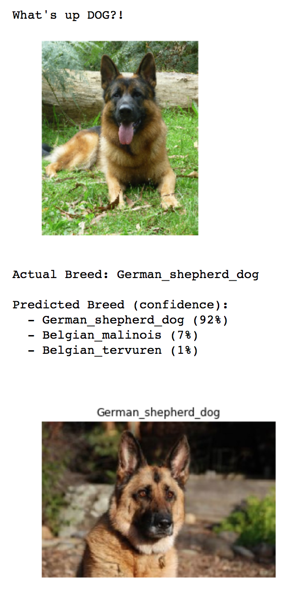
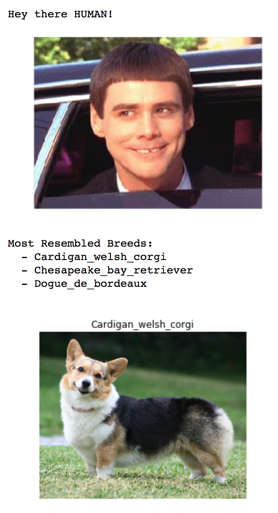

# Dog-Breed-Classifier
In this project , i build a pipeline that could be used in a web or mobile app to process real-world images. The pipeline consists of 3 models:
- ***Human Face detector*** - If given an image, model outputs *True if Human face* is detected, else returns False 
- ***Dog detector*** - If given an image, model outputs *True if dog* is detected else outputs False.
- ***Dog breed detector*** - If given an image, model predicts the *dog breed* associated with that that image. If it detects dog, it will predict dog breed, if human face is detected, it predicts the dog breed that resembles with the human face.

Here are two sample outputs from the final algorithm:

### Model architecture :
- **Human Face detector** - OpenCV pre-trained face detectors.
- **Dog detector** -VGG-16 model, along with weights trained on ImageNet dataset [ dog labels from 151 to 268].
- **Dog breed detector** :
  - Building a CNN model from Scratch[ 13 layers ] with accuracy 13%
  - Using Tranfer learning with VGG-16 model with accuracy 83%

### Hyperparameters(Dog breed detector)  :
- Batch_size = 20
- num_epochs = 5
- learning_rate = 0.001 with SGD optimizer.
- added batch normalization

### Dataset :
  - [dog dataset](https://s3-us-west-1.amazonaws.com/udacity-aind/dog-project/dogImages.zip)
  - [human dataset](https://s3-us-west-1.amazonaws.com/udacity-aind/dog-project/lfw.zip)
